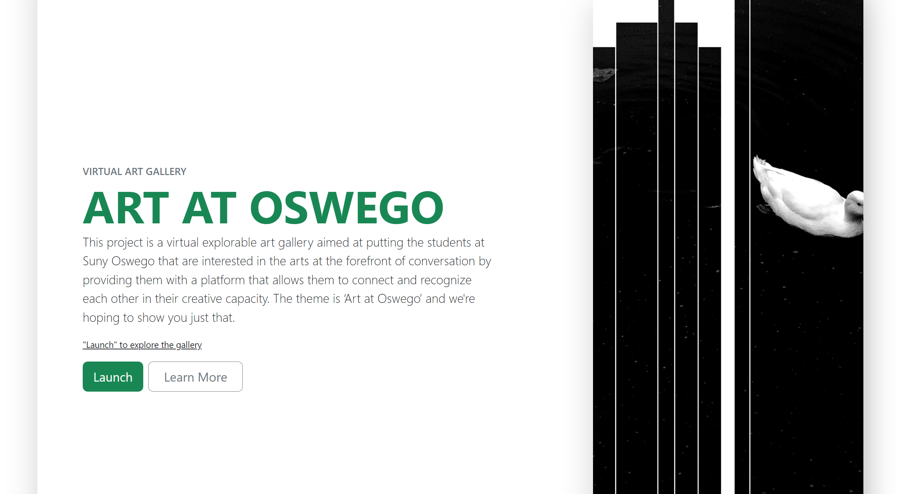

# Virtual Art Gallery - Highlighting art at Suny Oswego

This project is a virtual explorable art gallery aimed at putting the students at Suny Oswego that are interested in the arts at the forefront of conversation by providing them with a platform that allows them to connect and recognize each other in their creative capacity.

This project exists in limited capacity and function, but illustrates understanding of hypermedia techniques and creativity.

### Screenshot

### Built with

- HTML - formatting
- CSS - Styling
- Bootstrap - for styling and components

### Continued development

Ideally, this platform could be utilized to give creatives a platform to higly their work. Continued development would be adding accesibility features such as ARIA roles.

## Author

- [Kervens Auguste]

## Acknowledgments

This project was built to meet a course requirement, but has potential to continue as an independent platform wither within the indented Suny Oswego community or elsewhere.
